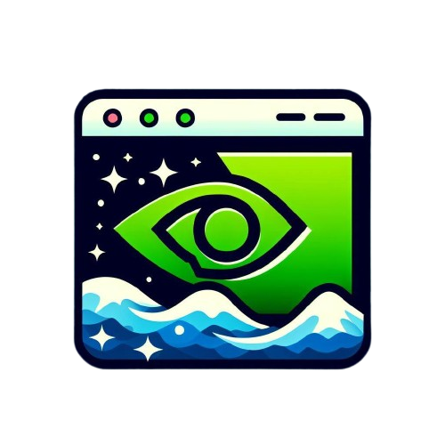

<h1 align="center">
  <br>
  <a href="https://github.com/TolunayM/dlss-updater"></a>
  <br>
    WhatsInit
  <br>
</h1>


<h4 align="center">Command-line tool for DLSS management</h4>

Dlss-updater is a small command-line tool that allows you to manage your DLSS files.


# How To Install
There are two ways to install d3u to your system.

First one is installing golang to your machine and after that using build and install commands. (easy and quick way)
Second one is, you can get pre-build executable from releases and after that you need to add to your PATH for accessing it. (if you wish)

I'm going with first method


```bash
# Clone this repository
$ git clone https://github.com/TolunayM/dlss-updater

# Open project folder and use built-in go commands for installing directly to your commandline
go build
go install
```
    After first run you can find database and dlss folders in your home directory.


# How To Use


After installing you can just start a new terminal and use command

```bash
d3u
```
It will list available commands


Add games' location and DLSS infos to database
```bash
    d3u add
```
List games' info and DLSS version
```bash
    d3u get
```
Remove game's info from database. You can type multiple games at once just use double quotes if game has spaces in names
```bash
    d3u remove "{GameName}"
    d3u remove {GameName} {SecondGameName} "{This Has Spaces In It's Name}"
```


You can upgrade or downgrade your games' DLSS version with update command.
You can specify DLSS version with -v or -version flag.
Default is latest

```bash
    d3u update {GameName} 
```

```bash
    d3u update {GameName} -v 3.5.0 or d3u update {GameName} {NthGameName} -v "3.5.0"
```


Check out DLSS repo for all DLSS versions.

[DLSS-REPOSITORY](https://github.com/TolunayM/dlss-repo)


# Built With

Cobra-cli
BBolt


## License
GNU

